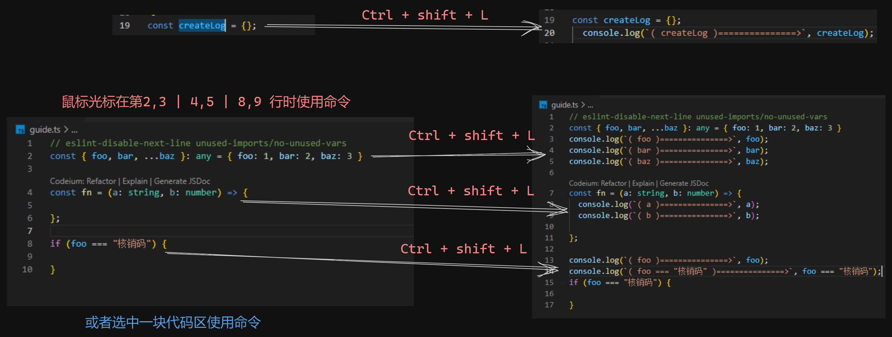

# vs-quick-log



## Create console.log

### SingleLine

> 单行使用方式是指光标所在行或者选中内容只有一行的情况下按下 `ctrl+shift+L` 快捷键后会在当前行识别内容进行 console.log 创建

识别当前行的 `变量` | `函数参数` | `if 语句中的判断条件` 创建 console.log

> 单行使用方式如果当前行没有找到可创建 console.log 的内容, 会尝试识别上一行的可打印内容

### MultiLine

> 多行使用方式是指按下 `ctrl+shift+L` 快捷键后会在选中的多行识别内容进行 console.log 创建

识别多行所有的 `变量` | `函数参数` | `if 语句中的判断条件` 创建 console.log

### Other

如果上面不能满足你的要求, 你可以选中任何符合 `变量命名规则` | `(this|xx).xx.xx` 的内容后按 `ctrl+shift+L` 创建 console.log

## Clear console.log

`ctrl+shift+delete` 清除当前文件所有非注释的 console.log (**打包发布后不生效, 正在尝试修复中**)

## FAQ

1. 光标使用方式同时存在变量和参数只创建参数的 console.log ?

这是刻意为之, 如果同一行代码同时存在变量和参数大概率该行是一个函数表达式, 这种情况我们一般需要创建 `console.log` 的是参数而不是变量.

```javascript
const fn = (a, b) => {
  // 这里一般需要打印的是 a, b 而不是 fn
};
```

[GitHub 欢迎 issue & pr](https://github.com/xiaoyao-Ye/vs-quick-log)
